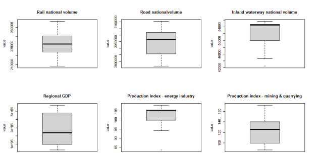
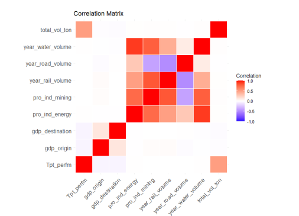
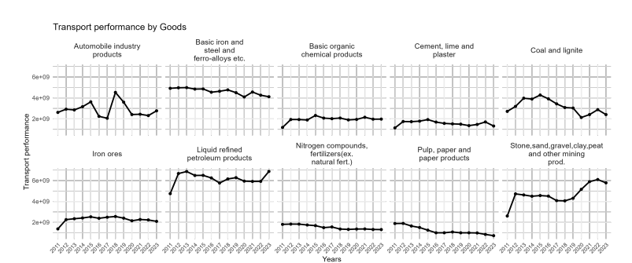
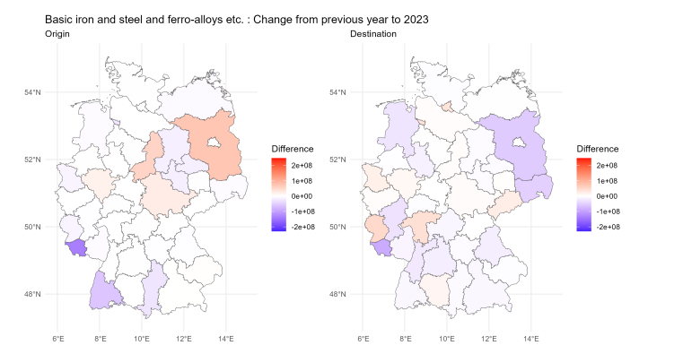
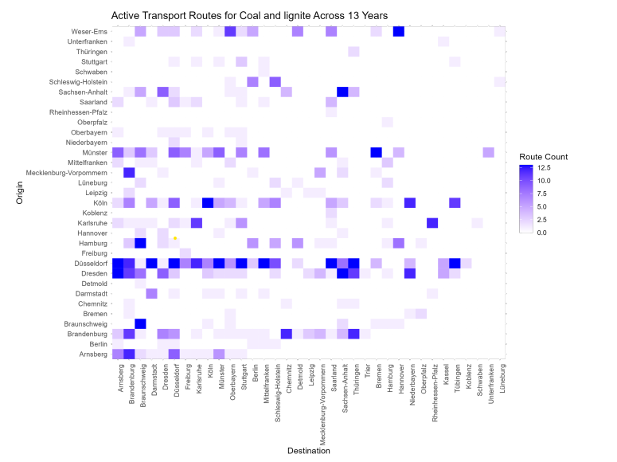
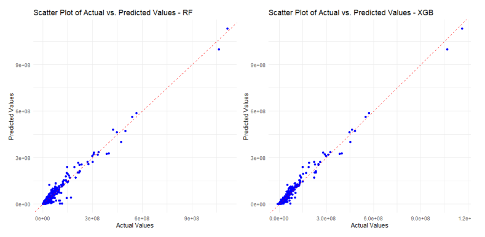
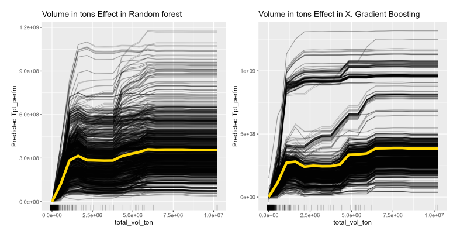

# 🚆 Freight Transport Analysis & Forecasting in Germany using R

This project was developed as part of the **Applications in Data Analytics** module during my master's program at **TU Dresden, Germany**. 
It demonstrates an end-to-end data science workflow in **R** — from data cleaning and exploration to forecasting freight rail transport performance using machine learning models.

**Data Sources**: Public datasets from [German Federal Statistical Office](https://www.destatis.de/DE/Home/_inhalt.html). Access cleaned datasets by me [here](data)

---

## 📌 Project Overview

- **Goal**: Explore Germany freight rail transport volume patterns over 13 years and forecast rail freight transport performance.
- **Tools**: R, mlr3 ecosystem, and libraries (`tidyverse`, `mlr3`, `mlr3tuning`, `randomForest`, `xgboost`, `ggplot2`, `sf`, `tmap`,...)
---

## ⚙️ Methods Overview

1. Data Extraction, Transformation, and Loading (ETL)
2. Exploratory Data Analysis (EDA)
3. Spatial & Temporal Visualization
4. Machine Learning Modeling
5. Model Interpretation & Evaluation

---

## 📁 1. ETL (Extract, Transform, Load)

### 🔧 Libraries Used
- `readr`, `data.table`, `dplyr` – for data loading and wrangling  
- `sf`, `geojsonio`, `tmap` – for geographic data processing  

### 🎯 Key Tasks
- Load and clean different datasets
- Model data featuers

### ✅ Outcome
- Final dataset: 11,726 observations with 11 features (columns)
---

## 📊 2. Exploratory Data Analysis (EDA)

### 🧰 Libraries Used
- `ggplot2`, `summarytools`, `dplyr`

### 🎯 Goals
- Understand summary statistics, variable distributions and outliers  
- Examine correlations and multicollinearity  

### 📈 Visual Outputs

#### 📦 Boxplots of Numerical Variables  
  
*Visualizes spread and outliers in data features*

#### 🔍 Correlation Matrix  
  
*Highlights strong correlations between features*

---

## 🗺️ 3. Spatial & Temporal Visualizations

### 🧰 Libraries Used
- `ggplot2`, `sf`, `tmap`

### 🎯 Goals
- Explore changes in transport patterns over time and space  

#### ⏳ Temporal Trends by Goods  
  
*Shows yearly transport performance of top 10 goods*

#### 🗺️ Spatial Distribution of Transport  
  
*Visualizes Regional transport intensity in 2023 (e.g. Düsseldorf, Braunschweig)*

#### 🔥 Route Activity Heatmap  
  
*Highlights routes with consistent yearly activity over 13 years*

---

## 🤖 4. Machine Learning (ML) Pipeline

### 🧰 Libraries Used
- `mlr3`, `mlr3tuning`, `mlr3viz`, `xgboost`, `randomForest`

### 🎯 Key Steps
- Frame as a regression problem
- Train and tune different models: Linear Regression, Random Forest, XGBoost
- Perform nested resampling for unbiased validation
- Perform Feature selection and ML models' hyperparameter tuning to increase prediction performance

### 📉 Performance Metrics

| Model        | RMSE (tkm) | MAE (tkm) | MAPE (%) | R²     |
|--------------|------------|-----------|----------|--------|
| RF (Tuned)   | 10.18M     | 3.36M     | **1.03** | 0.969  |
| XGB (Tuned)  | 7.91M      | 2.64M     | **6.42** | 0.981  |

---

## 🧠 5. Model Inspection & Interpretation

### 🎯 Goals
- Understand the influence of top features to verify the model's accuracy 
- Evaluate model behavior and possible biases  

#### 📉 Predicted vs Actual Scatterplot  
  
*Visual comparison of predicted vs actual transport performance*

#### 📊 Feature Effects (PDP & ICE)  
  
*Partial dependence and individual conditional effects for rail volume*

---

## 📖 Citation & Acknowledgment

This project is based on a seminar paper by **Thu Thuy Nguyen - MSc. Transport Economics – TU Dresden, Germany**

If using this project for academic or educational purposes, please cite the report or credit the author.
To read in detailed report, [click here](Detailed_analysis_Report.pdf)

---
